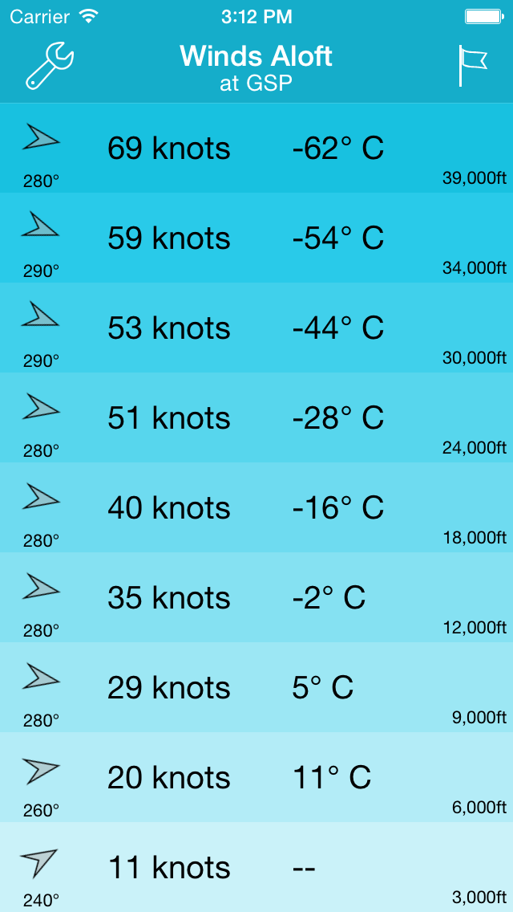
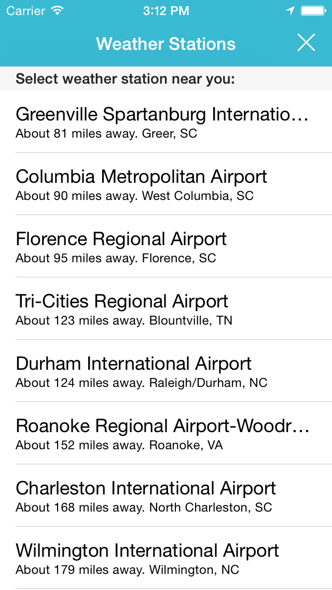
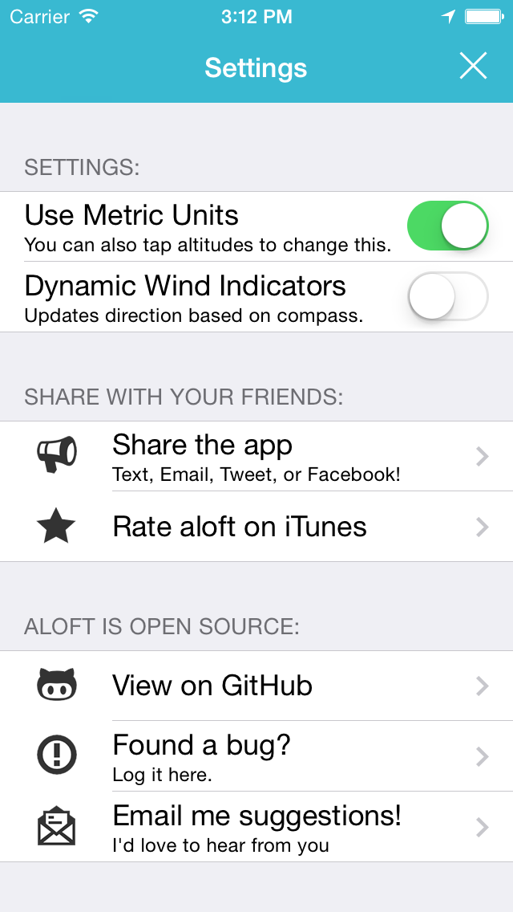
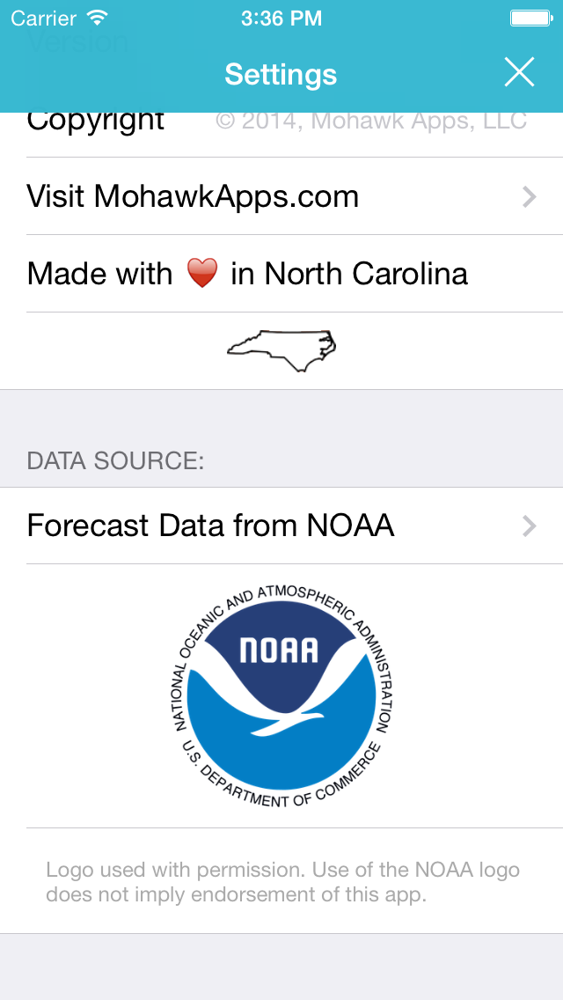

# aloft 

#### A [RubyMotion](http://www.rubymotion.com/) application brought to you by [Mohawk Apps](http://www.mohawkapps.com/).

aloft is the beautiful new way to check NOAA winds aloft forecasts from your iOS device! 

Whether you are a pilot, skydiver, wingsuiter, or simply an aviation enthusiast-this app is for you! 

App Features: 

* Pick any NOAA weather station that provides winds aloft forecast data. 
* Weather stations are automatically sorted by how close they are to you. This helps you choose the closes station with ease. 
* Shows bearing and wind directional arrow for each altitude. 
* Easily switch between metric and imperial units. 
* Use your phone's compass to dynamically update the wind direction arrow to the actual direction the wind is blowing! 

Give aloft a try and you'll never need to figure out what "760253" means again! 

For the curious, "760253" means: Winds at 102 knots bearing 260 degrees at 53°C... or -53°C if above 24,000 feet. 

This app is open source. Browse the source code here: https://github.com/MohawkApps/aloft/

## Icon

Icon by the talented [Mel Shields](http://dribbble.com/shieldsma91).

## How to run the app:

1. You must have a valid license of RubyMotion.
2. Run `bundle`
3. Run `rake pod:install`
4. Run `rake`
5. The simulator should launch automatically.

*Compass tracking of wind direction based on phone orientation requires that you run it on an actual device. Building RubyMotion apps to a device is out of  the scope of this readme.*

## Screenshots

   

## Contributing:

1. Fork it.
2. Work on a feature branch.
3. Send me a pull request.

*I also like it when people who can't contribute [open an issue](https://github.com/MohawkApps/aloft/issues)*
